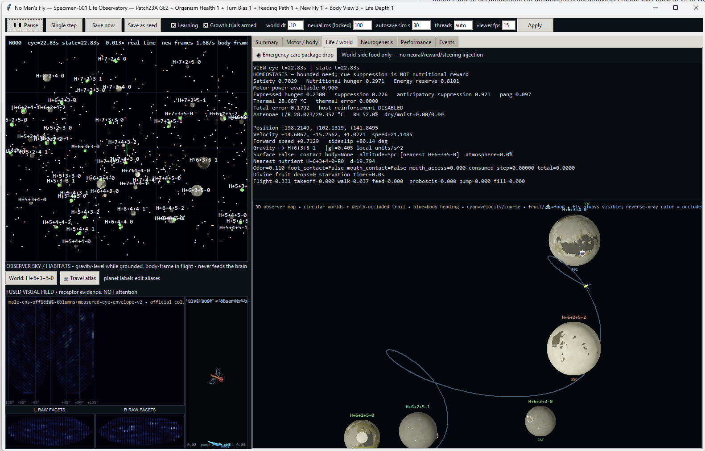

# No Man's Fly

A persistent, connectome-driven fly simulation with a body, compound eyes, sensory feedback, bounded physiology, and synaptic learning in a procedural universe.

The full CNS baseline retains **166,700 neurons**, **25,582,938 directed connections**, and **124,177,617 synaptic contacts** from the pinned MaleCNS v1.0 release. The body and sensory models are experimental approximations; this is not a claim of biologically complete flight or consciousness.

*The Observatory in a live session. Left: observer sky, receptor views, and body display. Right: physiological telemetry and the world map. Screenshot supplied by the project author; displayed performance depends on the machine and workload.*

## Start on Windows

1. Install **64-bit Python 3.10 or newer**, including Tkinter, and clone or extract the project into a writable folder.
2. Double-click **NO_MANS_FLY.bat**. **SETUP_AND_RUN.bat** is an equivalent bootstrap; both open the graphical loader.
3. Choose **Continue** for an existing lineage, or **New Fly** and a seed, then click **Begin**.
4. The loader handles dependency checks, graph preparation/validation, CPU thread selection, and optional GPU setup. First setup needs internet access to install dependencies and download the pinned graph sources if the baseline is absent.

The project uses its own `.venv`. The required brain graph is `data/male-cns-v1.0-full-graph-v2.npz`; large brain data and live checkpoints are excluded from Git. Building the baseline downloads roughly 1.1 GiB of official source data and checks the pinned source hashes and graph totals. Allow additional disk space and startup time for preparation.

The optic-column workbook, `data/optic-column-type-assignments-v1.0.xlsx`, is recommended for a self-contained installation. The eye mapper can attempt a download and has an offline fallback.

## What runs in the loop

- **Neural activity and learning:** a full sparse CNS model with bounded existing-edge plasticity and separate slow modulatory fields.
- **Vision:** spectral surface sampling drives mapped photoreceptors through the eye model. The viewer displays those same surface spectra through a human color conversion; GUI pixels are not fed to the brain.
- **Body and senses:** mapped motor output drives wings, legs, feeding, and other effectors. Proprioception, resource-related chemical/contact signals, humidity, and thermal inputs provide environmental feedback.
- **Physiology:** persistent satiety, energy, and thermal state. Global host reinforcement is disabled; internal state reaches the network through the implemented sensory/homeostatic pathways.
- **Persistence:** checkpoints retain neural, learned, body, world, random-generator, sensory-history, and motor-command state.

The environment is deliberately synthetic, including flight through an air-like space medium. It does not model pain, injury, starvation damage, or death. Missing or uncertain biological mappings remain limitations, not evidence that every sense or actuator is implemented.

## Observatory controls

Use **Pause**, **Single step**, **Save now**, and **Save as seed** to control a session. **Learning** controls synaptic adaptation. **Growth trials armed** permits recorded structural proposals, not automatic neuron creation.

The tabs expose network activity, motor output, physiology, world state, growth information, timing, and events. The **Travel atlas** shows encountered worlds and a recent actual flight trace with equal X/Y scaling; the trace is session-local. World aliases can be edited. The portal system has been removed.

The emergency care package places food in the world. It does not supply a steering command or host reward.

## Seeds and saved flies

`Runs/Specimen-Seed/` holds the original shared 166,700-neuron seed. It is immutable: birth, save, and reset do not overwrite it. A damaged default seed causes an error instead of silent replacement.

Each fly has its own `Runs/Specimen-NNN-Live/` state. New-fly allocation reuses available numbering gaps. **Save as seed** creates a separate numbered custom seed such as `Runs/Specimen-Seed-001/`, preserving that fly's graph and checkpoint for branching. Custom-seed numbering is independent of live-fly numbering.

To continue a particular fly, preserve its complete live lineage and referenced graph/seed files. JSON and NPZ files inside `Runs/` are persistent organism state, not disposable test output. Git ignores them, so a Git checkout alone is not a backup of your flies.

## CPU, GPU, and timing

**Use GPU if available** enables supported NVIDIA CUDA acceleration. Normal neural epochs run on one backend; they are not routinely simulated twice for validation. Without a usable GPU, with GPU disabled, or after a recoverable CUDA failure, the CPU implementation remains available. Learning and sensory work still include CPU processing.

**threads=auto** benchmarks scratch workloads and selects a CPU worker count without advancing the organism. A manual count is also available. Initial compilation and CUDA setup can make startup slower.

By default, **0.10 seconds of world time equals 100 ms of neural time**. The controller divides that window into **twelve real simulation slices**, carrying neural state forward and applying completed motor commands to the next interval. Learning accumulates over the full window. The viewer shows completed sampled poses; it does not predict future movement to hide slow computation.

Twelve slices are drawing opportunities, **not a promise of twelve FPS**. The viewer FPS field is a rendering cap. Neural integration, sensing, learning, and checkpoint I/O can run slower than real time; consult the Performance tab's new-frame rate and simulation-time ratio.

For unattended local runs, `RUN_HEADLESS_OVERNIGHT.bat` runs the default Specimen-003 lineage without the GUI after setup. It saves rendering overhead, not the neural workload. Do not run a second process against the same live lineage. Ctrl+C stops the headless runner and triggers its exit-save path.

## World pack

The extracted `assets/No_Mans_Fly_WorldPack_v2/` supplies six reusable spectral surface templates:

- Earthlike Rocky
- Marslike Rocky
- Moonlike Rocky
- Gas Giant
- Trans-Neptunian
- Rocky VI: The Voyage Home

The bootstrap habitat uses Earthlike Rocky; other world IDs select templates deterministically. Shared cached spectra supply both eye sampling and observer surfaces, including distant planet sprites. Existing radius and albedo variation remains. Without the optional pack, the procedural texture fallback is used. Restart after changing assets.

**Current integration is visual and spectral.** Displaced terrain, OBJ collision meshes, composition/chemical fields, environmental resource maps, and template-specific landing rules are not enabled. The gas-giant template currently changes appearance only; existing habitat physics still applies. No performance speedup is claimed.

See [world-pack integration details](WORLD_PACK_INTEGRATION.md). Git includes the pack's required spectral and temperature arrays through narrow ignore exceptions; the redundant ZIP remains ignored.

## Growth and flight: current boundaries

Automatic high-activity cloning has been retired. Positive plastic saturation and sustained activity in disconnected sources can identify growth candidates. Compatible connection proposals are recorded under the live lineage's `GrowthTrials/` directory; **they do not modify the live brain**. Existing-edge learning continues independently.

The evaluation helper rejects uniform amplification and excessive quiet-state firing. An automated isolated replay, selection, pruning, and promotion loop is still unfinished. The full-graph compiler enforces explicit structural strength transfers for new edges and preserves fractional gains. See [the growth model](GROWTH_MODEL.md).

Flight now includes a reduced muscle-driven nose-up/nose-down pathway, power-gated aerodynamic steering, and body-relative drag. Its gains and rate-to-muscle interpretation remain engineering approximations; these repairs do not establish realistic long-term fly behavior. See [the flight model](FLIGHT_MODEL.md) and [sensory coverage and limitations](SENSORY_MODEL.md).

## Code and data

| Area | Main files |
| --- | --- |
| Startup and GUI | `no_mans_fly_launcher.py`, `specimen003_desktop.py` |
| Experiment and CNS | `specimen003_experiment.py`, `full_plastic_connectome.py`, `plastic_connectome.py` |
| Acceleration | `gpu_neural.py`, `cuda_graph.py` |
| Body and senses | `fly_body.py`, `compound_eye.py`, `proprioception.py`, `life_sensory.py`, `homeostasis.py` |
| World and surfaces | `living_universe.py`, `space_fly_universe.py`, `world_visual.py`, `world_assets.py` |
| Growth and repair | `connectome_evolution.py`, `full_connectome_evolution.py`, `evolutionary_growth.py`, `neural_stability.py` |
| Persistence and delivery | `seed_store.py`, `observer_delivery.py` |

Keep the complete runtime source tree and required assets. `Historical/` contains archived development files and source backups; it is excluded from Git along with `.venv/`, caches, large brain/source data, and `Runs/`.

Recent development checks exercised the full 166,700-neuron model, CPU/GPU paths, sliced stepping, checkpoint resume, shared spectral sampling, growth safeguards, and hidden GUI rendering. These are implementation checks, not biological validation or guaranteed performance on another machine.

See [ATTRIBUTION.md](ATTRIBUTION.md) for data and project attribution.
